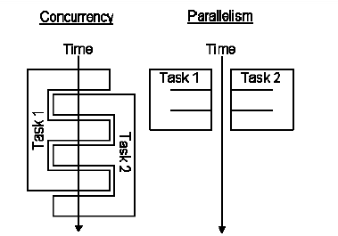

# Part 12 Concurrent Programming with Java Threads

---

## Topic in This Section

- **Motivation**
  - Comparing concurrent and parallel programming
- **Basic approach**
  - Make a task list with Executors.newFixedThreadPool
  - Add tasks to list with taskList.execute(someRunnable)
- **Variations on the theme**
  - Separate classes that implement Runnable
  - Main app implements Runnable
  - Inner classes that implement Runnable
  - Lambda expressions

---
## Topic in This Section

- **Related topics**
  - Race conditions and synchronization
  - Helpful Thread-related methods
  - Advanced topics in concurrency

---

## Overview

---

## Motivation for Concurrent Programming
**Pros**
  - Advantages even on single-processor systems
    - Efficiency
        - Downloading network data files
    - Convenience
        - A clock icon
    - Multi-client applications
        - HTTP Server, SMTP Server

---

## Motivation for Concurrent Programming
**Pros**
  - Many computers have multiple processors
    - Find out via Runtime.getRuntime().availableProcessors()

**Cons**
  - Significantly harder to debug and maintain than single-threaded apps

---

## Concurrent vs. Parallel Programming

- **Concurrent**
    - Tasks that overlap in time
        - The system might run them in parallel on multiple processors, or might switch back and forth among them on the same processor
- **Parallel**
    - Task that run at the same time on different processors

---

## Concurrent vs. Parallel Programming




- **Concurrent** = **Two queues** with Only **One Coffee** Machines
- **Parallel** = **Two queues** with **Two Coffee** Machines

---
## Java Threads vs Fork/Join Framework

- **Using Java Threads (Concurrent)**
    - When task is relatively large and self-contained
        - Usually when you are waiting for something, so would benefit even if there is only one processor
        - Covered in this lecture
    - Needed even in Java 8 where you have parallel streams

---

- **Using Fork/Join or Parallel Streams**
    - When task starts large but can be broken up repeatedly into smaller pieces, then combined for final result.
    - No benefit if there is only one processor
    - Covered in next lecture
        - Also, parallel version of Streams, covered in separate lectures, uses fork/join framework under the hood, can handle the majority of situations where you want to use fork/join, and is dramatically simpler than using fork/join explicitly. Java 8 developers can skip learning fork/join and concentrate on parallel streams instead.

---

## Basic Steps for Concurrent Programming

---

## Steps for Concurrent Programming

-  **Make a task list**

```java
        ExecutorService taskList = Executors.newFixedThreadPool(poolSize);
```

- The poolSize is the maximum number of _simultaneous_ threads. For many apps, it is higher than the number of tasks, so each task has a separate thread.
- There are other types of thread pools, but a fixed thread pool is simplest and most common

---

## Steps for Concurrent Programming (cont)

-  **Add Runnable tasks to the list**

```java
    taskList.execute(someRunnable);
```

---

## Variations for Adding Runnable to Task List

-  **Make separate class that implements Runnable**

```java
        taskList.execute(new MySeparateRunnableClass(…));
```

- Have your existing class implement Runnable
```java
        taskList.execute(this);
```
---

## Variations for Adding Runnable to Task List (cont)

-  **Use an inner class**
```java
        taskList.execute(new MyInnerRunnableClass(…));
```
- This could be a named inner class or an anonymous inner class

-  **Use a Lambda**
```java
        taskList.execute(() -> codeForRunMethod());
```
---

## Approach #1: Separate Classes that Implement Runnable

---

## Threads Mechanism #1: Separate Runnable Class

- Make class that implements Runnable
    - No import statements needed: Runnable is in java.lang
- Put actions to be performed in run method
```java
        public class MyRunnable implements Runnable {
            public void run() { someBackgroundTask(); }
        }
```
- Create instance of your class
    - Or lots of instances, if you want lots of threads

---

- Pass instance to ExecutorService.execute
 ```java
        taskList.execute(new MyRunnable(…));
 ```
 The number of simultaneous threads won’t exceed the maximum size of the pool

---

## Separate Runnable Class: Template Code

    public class MainClass extends SomeClass {
        ...
        public void startThreads() {
            int poolSize = ...;
            ExecutorService taskList = Executors.newFixedThreadPool(poolSize);
            for(int i=0; i<something; i++) {
                taskList.execute(new SomeTask(...));
            }
        }
    }


    public class SomeTask implements Runnable {
        public void run() {
        // Code to run in the background
        }
    }

---

## Thread Mechanism #1: Example

    public class Counter implements Runnable {
        private final App1 mainApp;
        private final int loopLimit;

        public Counter(App1 mainApp, int loopLimit) {
            this.mainApp = mainApp;
            this.loopLimit = loopLimit;
        }

        public void run() {
            for(int i=0; i<loopLimit; i++) {
                String threadName = Thread.currentThread().getName();
                System.out.printf("%s: %s%n", threadName, i);
                mainApp.pause(Math.random());
            }
        }
    }

---

## Thread Mechanism #1: Example (cont.)

    public class App1 extends SomeClass {
        public App1() {

        ExecutorService taskList = Executors.newFixedThreadPool(100);
        taskList.execute(new Counter(this, 6));
        taskList.execute(new Counter(this, 5));
        taskList.execute(new Counter(this, 4));
        taskList.shutdown();
    }

    public void pause(double seconds) {
        try {
            Thread.sleep(Math.round(1000.0 * seconds));
        } catch (InterruptedException ie) { }
        }
    }

---
## Thread Mechanism #1: Example (cont.)

- The shutdown method means that the task list will no longer accept new tasks (via execute).
- Tasks already in the queue will still run. It is not usually necessary to call shutdown, but in this case, you want the program to exit after the tasks are completed.

---

## Thread Mechanism #1: Example (cont.)

- If you didn’t call shutdown here, you would have to kill the process with Control-C (command line) or clicking the red button (Eclipse), because a background thread will still be running, waiting for new tasks to be added to the queue.


    public class App1Test {
        public static void main(String[] args) {
            new App1();
        }
    }

---

## Thread Mechanism #1: Results

    pool-1-thread-1: 0
    pool-1-thread-2: 0
    pool-1-thread-3: 0
    pool-1-thread-2: 1
    pool-1-thread-2: 2
    pool-1-thread-1: 1
    pool-1-thread-3: 1
    pool-1-thread-2: 3
    pool-1-thread-3: 2
    pool-1-thread-1: 2
    pool-1-thread-1: 3
    pool-1-thread-1: 4
    pool-1-thread-3: 3
    pool-1-thread-2: 4
    pool-1-thread-1: 5

---

## Pros and Cons of Separate-Class Approach

- **Advantages**
    - Loose coupling
        - Can change pieces independently
        - Can reuse Runnable class in more than one application
    - Passing arguments
        - If you want different threads to do different things, you pass args to constructor, which stores them in instance variables that run method uses

---
## Pros and Cons of Separate-Class Approach

### Advantages

- Little danger of race conditions
    - You usually use this approach when there is no data shared among threads, so no need to synchronize.

### Disadvantages
- Hard to access main app
    - If you want to call methods in main app, you must
        - Pass reference to main app to constructor, which stores it
        - Make methods in main app be public

---

## Approach #2: Main App Implements Runnable

---

## Thread Mechanism #2: Main App Implements Runnable

- **Have main class implement Runnable**
    - Put actions in run method of existing class
```java
            public class MyClass extends Something implements Runnable {
                ...
                public void run() {
                    ...
                }
            }
```
- **Pass the instance of main class to execute**
```java
        taskList.execute(this);
```

---

## Main App Implements Runnable: Main Differences vs. Sep. Class

- **Good news**
    - run can easily call methods in main class, since it is in that class
- **Bad news**
    - If run accesses any shared data (instance variables), you have to worry about conflicts (race conditions)
    - No constructor, so very hard to customize how each thread runs, and thus each task starts off the same way

---

## Main App Implements Runnable: Template Code

    public class ThreadedClass extends AnyClass implements Runnable {

        public void run() {
        // Code to run in background
        }

        public void startThreads() {
            int poolSize = ...;
            ExecutorService taskList = Executors.newFixedThreadPool(poolSize);

            for(int i=0; i<someSize; i++) {
                taskList.execute(this);
            }
        }

        ...
    }

---

## Thread Mechanism #2: Example

    public class App2 extends SomeClass implements Runnable {

        private final int loopLimit;

        public App2(int loopLimit) {
            this.loopLimit = loopLimit;
            ExecutorService taskList = Executors.newFixedThreadPool(100);
            taskList.execute(this);
            taskList.execute(this);
            taskList.execute(this);
            taskList.shutdown();
        }

        private void pause(double seconds) {
            try {
                Thread.sleep(Math.round(1000.0 * seconds));
            } catch (InterruptedException ie) { }
        }

---

## Thread Mechanism #2: Example (cont.)

        public void run() {
            for(int i=0; i<loopLimit; i++) {
                String threadName = Thread.currentThread().getName();
                System.out.printf("%s: %s%n", threadName, i);
                pause(Math.random());
            }
        }
    }

---

## Thread Mechanism #2: Example (cont.)

    public class App2Test {
        public static void main(String[] args) {
            new App2(5);
        }
    }

---

## Thread Mechanism #2: Results

    pool-1-thread-3: 0
    pool-1-thread-1: 0
    pool-1-thread-2: 0
    pool-1-thread-2: 1
    pool-1-thread-3: 1
    pool-1-thread-3: 2
    pool-1-thread-1: 1
    pool-1-thread-2: 2
    pool-1-thread-3: 3
    pool-1-thread-2: 3
    pool-1-thread-1: 2
    pool-1-thread-3: 4
    pool-1-thread-1: 3
    pool-1-thread-2: 4
    pool-1-thread-1: 4

---

## Pros and Cons of Approach

### Advantages
- Easy to access main app.
    - run is already inside main app. Can access any public or private methods or instance variables.

---

## Pros and Cons of Approach

### Disadvantages
- Tight coupling
    - run method tied closely to this application
- Cannot pass arguments to run
    - So, you either start a single thread only (quite common), or all the threads do very similar tasks
- Danger of race conditions
    - You usually use this approach specifically because you want to access data in main application. So, if run modifies some shared data, you must synchronize.

---

## Approach #3: Inner Class that Implements Runnable

---

## Thread Mechanism Three: Runnable Inner Class

- Have inner class implement Runnable
    - Put actions in run method of inner class
```java
            public class MyClass extends Whatever {
                …
                private class InnerClass implements Runnable {

                    public void run() {
                        ...
                    }
                }
            }
```
- Pass instances of inner class to execute
```java
        taskList.execute(new InnerClass(...));
```
---

## Inner Class Implements Runnable: Template Code

    public class MainClass extends AnyClass {
        public void startThreads() {

            int poolSize = ...;

            ExecutorService taskList = Executors.newFixedThreadPool(poolSize);
            for(int i=0; i<someSize; i++) {
                taskList.execute(new RunnableClass(...));
            }
        }
        ...
        private class RunnableClass implements Runnable {
            public void run() {
            // Code to run in background
            }
        }
    }

---

## Minor Variation: Anonymous Inner Class

    public class MainClass extends AnyClass {
        public void startThreads() {

            int poolSize = ...;

            ExecutorService taskList = Executors.newFixedThreadPool(poolSize);

            for(int i=0; i<someSize; i++) {
                taskList.execute(new Runnable() {
                public void run() {
                    ...
                }
                });
            }
        }
    }

---

## Thread Mechanism #3: Example

    public class App3 extends SomeClass {
        public App3() {
            ExecutorService taskList = Executors.newFixedThreadPool(100);
            taskList.execute(new Counter(6));
            taskList.execute(new Counter(5));
            taskList.execute(new Counter(4));
            taskList.shutdown();
        }

        private void pause(double seconds) {
            try {
                Thread.sleep(Math.round(1000.0 * seconds));
            } catch (InterruptedException ie) { }
        }

---

## Thread Mechanism #3: Example (cont.)

        private class Counter implements Runnable { // Inner class
            private final int loopLimit;

            public Counter(int loopLimit) {
                this.loopLimit = loopLimit;
            }

            public void run() {
                for(int i=0; i<loopLimit; i++) {
                    String threadName = Thread.currentThread().getName();
                    System.out.printf("%s: %s%n", threadName, i);
                    pause(Math.random());
                }
            }
        }
    }

---

## Thread Mechanism #3: Example (cont.)

    public class App3Test {
        public static void main(String[] args) {
            new App3();
        }
    }

---

## Thread Mechanism #3: Results

    pool-1-thread-2: 0
    pool-1-thread-1: 0
    pool-1-thread-3: 0
    pool-1-thread-3: 1
    pool-1-thread-1: 1
    pool-1-thread-1: 2
    pool-1-thread-2: 1
    pool-1-thread-3: 2
    pool-1-thread-3: 3
    pool-1-thread-1: 3
    pool-1-thread-1: 4
    pool-1-thread-1: 5
    pool-1-thread-2: 2
    pool-1-thread-2: 3
    pool-1-thread-2: 4

---

## Pros and Cons of Approach

- **Advantages**
    - Easy to access main app.
        - Methods in inner classes can access any public or private methods or instance variables of outer class
    - Can pass arguments to run
        - As with separate classes, you pass args to constructor, which stores them in instance variables that run uses

---

## Pros and Cons of Approach

- **Disadvantages**
    - Tight coupling
        - run method tied closely to this application
    - Danger of race conditions
        - You usually use this approach specifically because you want to access data in main application. So, if run modifies some shared data, you must synchronize.

---

## Preview of Approach Four: Lambda Expressions

---

## Preview of Lambdas

- **Anonymous inner class**

```java
        taskList.execute(new Runnable() {
            @Override
            public void run() {
                doSomeTask(…);
            }
        });
```

- Lambda equivalent
```java
        taskList.execute(() -> doSomeTask(…));
```
---

## Summary of Approaches

---

## Pros and Cons

- **Separate class that implements Runnable**
    - Cannot easily access data in main class (and only public data)
    - Can pass args to run (indirectly via constructor and instance variables)
    - Usually no worry about race conditions
- **Main class implements Runnable**
    - Can easily access data in main class
    - Cannot pass args to run
    - Must worry about race conditions

---

## Pros and Cons

- **Inner class implements Runnable**
    - Can easily access data in main class
    - Can pass args to run (indirectly via constructor and instance variables)
    - Must worry about race conditions
- **Lambdas**
    - Can easily access data in main class
    - Cannot pass args to run (no instance variables)
    - Must worry about race conditions

---

## Example: Template for a Multithreaded Network Server

        import java.net.*;
        import java.util.concurrent.*;
        import java.io.*;
        public class MultithreadedServer {
            private int port;

            public MultithreadedServer(int port) {
                this.port = port;
            }

            public int getPort() {
                return(port);
            }

---

## MultithreadedServer.java (Continued)

            public void listen() {
                int poolSize = 100 * Runtime.getRuntime().availableProcessors();
                ExecutorService taskList = Executors.newFixedThreadPool(poolSize);
                try {
                    ServerSocket listener = new ServerSocket(port);
                    Socket socket;
                    while(true) { // Run until killed
                        socket = listener.accept();
                        taskList.execute(new ConnectionHandler(socket));
                    }
                } catch (IOException ioe) {
                    System.err.println("IOException: " + ioe);
                    ioe.printStackTrace();
                }
            }
        }

---

## ConnectionHandler.java

    public class ConnectionHandler implements Runnable {
        private Socket socket;

        public ConnectionHandler(Socket socket) {
            this.socket = socket;
        }

        public void run() {
            try {
                handleConnection(socket);
            } catch(IOException ioe) {
                System.err.println("IOException: " + ioe);
                ioe.printStackTrace();
            }
        }

        public void handleConnection(Socket socket) throws IOException{
        // Do something with socket
        }
    }

---

## Race Conditions and Synchronization

---

## Race Conditions: Example

    public class RaceConditionsApp implements Runnable {
        private final static int LOOP_LIMIT = 5;
        private final static int POOL_SIZE = 10;
        private int latestThreadNum = 0;

        public RaceConditionsApp() {
            ExecutorService taskList;
            taskList = Executors.newFixedThreadPool(POOL_SIZE);

            for (int i=0; i<POOL_SIZE; i++) {
                taskList.execute(this);
            }
        }

---

## Race Conditions: Example (cont.)

        public void run() {
            int currentThreadNum = latestThreadNum;
            System.out.println("Set currentThreadNum to " + currentThreadNum);
            latestThreadNum = latestThreadNum + 1;

            for (int i=0; i<LOOP_LIMIT; i++) {
                doSomethingWith(currentThreadNum);
            }
        }

        private void doSomethingWith(int threadNumber) {
        // Blah blah
        }
    }

- **What’s wrong with this code?**

---

## Race Conditions: Result

- **Expected Output**
```bash
        Set currentThreadNum to 0
        Set currentThreadNum to 1
        Set currentThreadNum to 2
        Set currentThreadNum to 3
        Set currentThreadNum to 4
        Set currentThreadNum to 5
        Set currentThreadNum to 6
        Set currentThreadNum to 7
        Set currentThreadNum to 8
        Set currentThreadNum to 9
```
---

## Race Conditions: Result

- **Occasional Output**
```bash
        Set currentThreadNum to 0
        Set currentThreadNum to 1
        Set currentThreadNum to 2
        Set currentThreadNum to 3
        Set currentThreadNum to 4
        Set currentThreadNum to 5
        Set currentThreadNum to 5 //diff. result
        Set currentThreadNum to 7
        Set currentThreadNum to 8
        Set currentThreadNum to 9
```
---

## Race Conditions: Solution?

- **Do things in a single step**
```java
        public void run() {
            int currentThreadNum = latestThreadNum++;
            System.out.println("Set currentThreadNum to " + currentThreadNum);

            for (int i=0; i<LOOP_LIMIT; i++) {
                doSomethingWith(currentThreadNum);
            }
        }
```
---

## Arbitrating Contention for Shared Resources

- **Synchronizing a section of code**
```java
        synchronized(someObject) {
            //code
        }
```

---
## Arbitrating Contention for Shared Resources

- **Normal interpretation**
    - Once a thread enters that section of code, no other thread can enter until the first thread exits
- **Stronger interpretation**
    - Once a thread enters that section of code, no other thread can enter any section of code that is synchronized using the same “lock” object
        - If two pieces of code say “synchronized(blah)”, the question is if the blah’s are the same object instance

---

## Arbitrating Contention for Shared Resources

- **Synchronizing an entire method**
```java
        public synchronized void someMethod() {
            //body
        }
```
- **This is equivalent to**
```java
        public void someMethod() {
            synchronized(this) {
                //body
            }
        }
```
---

## Fixing the Previous Race Condition
```java
        public void run() {
            int currentThreadNum;
            synchronized(this) {
                currentThreadNum = latestThreadNum;
                System.out.println("Set currentThreadNum to + currentThreadNum);
                latestThreadNum = latestThreadNum + 1;
            }

            for (int i=0; i<LOOP_LIMIT; i++) {
                doSomethingWith(currentThreadNum);
            }
        }
```
---

## Helpful Thread - Related Methods

---

## Methods in Thread Class

- **Thread.currentThread()**
    - Gives instance of Thread running current code
- **Thread.sleep(milliseconds)**
    - Puts calling code to sleep. Useful for non-busy waiting in all kinds of code, not just multithreaded code. You must catch InterruptedException, but you can ignore it:

```java
            try { Thread.sleep(someMilliseconds); }
            catch (InterruptedException ie) { }
```

- **someThread.getName(), someThread.getId()**
    - Useful for printing/debugging, to tell threads apart

---

## Methods in ExecutorService Class

- **execute(Runnable)**
    - Adds Runnable to the queue of tasks
- **shutdown**
    - Prevents any more tasks from being added with execute (or submit), but lets current tasks finish
- **shutdownNow**
    - Attempts to halt current tasks. But author of tasks must have them respond to interrupts (i.e., catch InterruptedException), or this is no different from shutdown.
- **awaitTermination**
    - Blocks until all tasks are complete. Must shutdown() first.

---

## Lower-Level Threading

- **Use Thread.start(someRunnable)**
    - Implement Runnable, pass to Thread constructor, call start

```java
            Thread t = new Thread(someRunnable);
            t.start();
```

- **Extend Thread**
    - Put run method in Thread subclass, instantiate, call start
```java
            SomeThread t = new SomeThread(…);
            t.start();
```

---

## Advanced Topics

---

## Runnable

- **Runnable**
    - “run” method runs in background. No return values, but run can do side effects.
    - Use “execute” to put in task queue

---
##Callable

- **Callable**
    - “call” method runs in background. It returns a value that can be retrieved after termination with “get”.
    - Use “submit” to put in task queue.
    - Use invokeAny and invokeAll to block until value or values are available
        - Example: you have a list of links from a Web page and want to check status (404 vs. good). Submit them to a task queue to run concurrently, then invokeAll will let you see return values when all links are done being checked.

---

## Types of Task Queues

- **Executors.newFixedThreadPool(nThreads)**
    - Simplest and most widely used type. Makes a list of tasks to be run in the background, but with caveat that there are never more than nThreads simultaneous threads running.
- **Executors.newScheduledThreadPool**
    - Lets you define tasks that run after a delay, or that run periodically. Replacement for pre-Java-5 Timer class.

---
## Types of Task Queues

- **Executors.newCachedThreadPool**
    - Optimized version for apps that start many short-running threads. Reuses thread instances.
- **Executors.newSingleThreadExecutor**
    - Makes queue of tasks and executes one at a time
- **ExecutorService (subclass) constructors**
    - Lets you build FIFO, LIFO, and priority queues

---

## Stopping a Thread

        public class SomeTask implements Runnable {
            private volatile boolean running;
            public void run(){
                running = true;
                while (running) {
                    ...
                }
                doCleanup();
            }

            public void setRunning(boolean running) {
                this.running = running;
            }
        }

- Compilers on multiprocessor systems often do optimizations that prevent changes to variables from one thread from being seen by another thread.
- To guarantee that other threads see your changes.

---

## Nasty Synchronization Bug (Part 1)


        public class Driver {
            public void startThreads() {
                …
                for(…) {
                    taskList.execute(new SomeHandler(...));
                }
            }
        }

- Separate class or inner class. But this problem does not happen when you put “this” here

---

## Nasty Synchronization Bug (Part 2)

    public class SomeHandler implements Runnable {
        public synchronized void doSomeOperation() {
            accessSomeSharedObject();
        }

        ...
        public void run() {
            while(someCondition) {
                doSomeOperation(); // Accesses shared data
                doSomeOtherOperation();// No shared data
            }
        }
    }

-  This `synchronized` keyword has no effect whatsoever in this context! Why not?

---

## Synchronization Solution

- **Solution 1: synchronize on outer class**
    - If your handler is an inner class, not a separate class
```java
            public OuterClassName {
                public void someMethod() {
                    ...
                    taskList.execute(new SomeHandler(...));
                }

                private class SomeHandler implements Runnable {
                    public void run() { ... }
                    public void doSomeOperation() {
                        synchronized(OuterClassName.this) {
                        accessSomeSharedObject();
                        }
                    }
                }
            }
```
---

## Synchronization Solution

- **Solution 2: synchronize on the shared data**
```java
        public void doSomeOperation() {
            synchronized(someSharedObject) {
                accessSomeSharedObject();
            }
        }
```
---

## Synchronization Solution

- **Solution 3: synchronize on the class object**
```java
        public void doSomeOperation() {
            synchronized(SomeHandler.class) {
                accessSomeSharedObject();
            }
        }
```
 - Note that if you use “synchronized” for a static method, the lock is the corresponding Class object, not “this”


---

## Synchronization Solution

- **Solution 4: synchronize on arbitrary object**
```java
        public class SomeHandler implements Runnable{
            private static Object lockObject = new Object();
            ...

            public void doSomeOperation() {
                synchronized(lockObject) {
                    accessSomeSharedObject();
                }
            }
            ...
        }
```
- Why doesn’t this problem usually occur with thread mechanism two (with run method in main class)?

---

## Determining Maximum Thread Pool Size

- **In most apps, a reasonable guess is fine**
```java
        int maxThreads = 100;
        ExecutorService taskList = Executors.newFixedThreadPool(maxThreads);
```
---

## Determining Maximum Thread Pool Size

- **If you need more precise values**
```java
        maxThreads = numCpus * targetUtilization * (1 + avgWaitTime/avgComputeTime)
```
- Compute numCpus with Runtime.getRuntime().availableProcessors()
- targetUtilization is from 0.0 to 1.0
- Find ratio of wait to compute time with profiling
- Equation taken from Java Concurrency in Practice

---

## Other Advanced Topics

- **wait/waitForAll**
    - Releases the lock for other threads and suspends itself (placed in a queue associated with the lock)
    - Very important in some applications, but very hard to get right.
- **notify/notifyAll**
    - Wakes up all threads waiting for the lock
    - A notified thread doesn’t begin immediate execution, but is placed in the runnable thread queue

---
## Other Advanced Topics

- **Concurrency utilities in java.util.concurrency**
     Advanced threading utilities including semaphores, collections designed for multithreaded applications, atomic operations, etc.
- **Debugging thread problems**
    - Use JConsole
        - http://docs.oracle.com/javase/8/docs/technotes/guides/management/jconsole.html

---
## Wrap-Up

---

## References

- **Books (all are before Java 8)**
    - Java Concurrency in Practice (Goetz, et al)
        - Brian Goetz is now the Java SE spec lead
    - Chapter 10 (“Concurrency”) of Effective Java, 2nd Ed (Josh Bloch)
        - Effective Java is the all-time best Java practices book
    - Java Threads (Oak and Wong)

---
## References
- **Online references**
    - Lesson: Concurrency (Oracle Java Tutorial)
        - http://docs.oracle.com/javase/tutorial/essential/concurrency/
    - Jacob Jenkov’s Concurrency Tutorial
        - http://tutorials.jenkov.com/java-concurrency/index.html
    - Lars Vogel’s Concurrency Tutorial
        - http://www.vogella.de/articles/JavaConcurrency/article.html

---

## Summary

- **Basic approach**
```java
        ExecutorService taskList = Executors.newFixedThreadPool(poolSize);
```
- **Three variations**
```java
        taskList.execute(new SeparateClass(…));
        taskList.execute(this);
        taskList.execute(new InnerClass(…));
```
- **Handling shared data**
```java
        synchronized(referenceSharedByThreads) {
            getSharedData();
            modifySharedData();
        }

        doOtherStuff();
```
---

## Questions ?