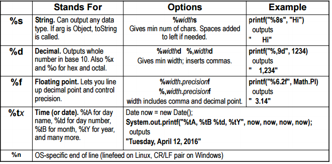

# Part 9 Generic Types, printf, and Utilities

---

## Topics

- Supporting generic types in your own code
  - Idea
  - Methods
  - Classes or interfaces
- printf
- varargs
- String vs. StringBuilder

---

## Generic Methods and Classes

- Basic Capability

You cannot properly use Lists, Maps, Sets, etc. without this

```java
List<Employee> workers = ...; //Notice the class 'Employee'
workers.add(new Employee(...)); // Type checked @ compile time
Employee e = workers.get(someIndex); // Return is Employee
```

```java
Map<String,Employee> workerTable = ...;
workerTable.put(someId, someEmployee);
Employee employeeWithId = workerTable.get(someId);
```

- Intermediate Capability

Done much more commonly in Java 8

```
public interface Map<K,V> { ... }
public static <T> T lastElement(List<T> elements) { ... }
```

---

## Generic Methods and Classes

- Using ```<TypeVariable>```
  - If you put variables in angle brackets in the class or method definition, it tells Java that uses of those variables refer to types, not to values
  - It is conventional to use short names in upper case, such as T, R (input type, result type) or T1, T2 (type1, type2), or E (element type)

```java
public class ArrayList<E> ... {
    ...
}
```

```java
public static <T> T randomElement(T[] array) {
    ...
}
```

---

## Generic Method

- Declaring method that support generic

```
public static <T> T best(List<T> entries, ...) { ... }
```

This says that the 'best' method takes a <b>List of T’s</b> and returns a <b>T</b>. The <b>```<T>```</b> at the
beginning means T is not a real type, but a type that Java will figure out from the method call.

- Java will figure out the type of T by looking at parameters to the method call

```java
List<Person> people = ...;
Person bestPerson = Utils.best(people, ...);
List<Car> cars = ...;
Car bestCar = Utils.best(cars, ...);
```

---

## Generic Method - Example

- Even if there is an existing class actually called T, it is irrelevant here.
- Generics work only with Object types, not primitive types.

```java
public class RandomUtils {
    private static Random r = new Random();

    public static int randomInt(int range) {
        return(r.nextInt(range));
    }

    public static int randomIndex(Object[] array) {
        return(randomInt(array.length));
    }

    public static <T> T randomElement(T[] array) {
        return(array[randomIndex(array)]);
    }
}
```

---

## Generic Method - Example 2

```java
String[] names = { "Joe", "John", "Jane" };
String name = RandomUtils.randomElement(names);

Color[] colors = { Color.RED, Color.GREEN, Color.BLUE };
Color color = RandomUtils.randomElement(colors);

Person[] people = { new Person("Larry", "Page"),
                    new Person("Larry", "Ellison"),
                    new Person("Larry", "Bird"),
                    new Person("Larry", "King") };
Person person = RandomUtils.randomElement(people);

Integer[] nums = { 1, 2, 3, 4 }; // Integer[], not int[]
int num = RandomUtils.randomElement(nums);
```

- No typecast required to convert (to String, Color, Person, etc)
- Autoboxing lets you assign entry from Integer[] to an int, but array passed to `randomElement` must be Integer[] not int[],
since generics work only with Object types, not primitive

---

## Generic Classes or Interfaces

- Declaring classes or interfaces that support generics

```java
public class SomeClass<T> { ... }
```

- Methods in the class can now refer to T both for arguments and for return values

```java
public T getSomeValue(int index) { ... }
```

- Java will figure out the type of T by your declaration

```java
SomeClass<Person> blah = new SomeClass<>();
```

---

## Generic Classes - Example

```java
public class ArrayList<E> {
    public E get(int index) { ... }
    public boolean add(E element) { ... }
    ...
}
```

- On the line 1, In rest of class, E does not refer to an existing type. Instead, it refers to whatever type was defined when you created the list.
  - If you did <b>```ArrayList<String> words = ...;```</b> then ```E``` refers to String.

---

## Generic Classes - Example

```java
public class ArrayList<E> {
    public E get(int index) { ... }
    public boolean add(E element) { ... }
    ...
}
```

- On the line 2, the syntax says that get returns an ```E```. So, if you created ```ArrayList<Employee>```, 'get' method returns an Employee.
No typecast required in the code that calls 'get' method.

---

## Generic Classes - Example

```java
public class ArrayList<E> {
    public E get(int index) { ... }
    public boolean add(E element) { ... }
    ...
}
```

- On the line 3, the syntax says that add takes an ```E``` as a parameter. So, if you created ```ArrayList<Circle>```, 'add' method can take only a Circle

---

## printf (Formatted Output)

- Lets you insert values into output, without much clumsier String concatenation
- Lets you control the width of results, so things line up
- Lets you control the number of digits after the decimal point in numbers, for consistent-looking output
- Applies to any ```PrintWriter``` or ```PrintStream```, not just to ```System.out```
- Similar with printf in C/C++

---

## printf - Quick Overview

- Values replace %s placeholders (%n means end-of-line)

```java
String name = "Jane";
double num = 1234.567;
System.out.printf("%s's number is %s.%n",
                    name, num);
```

```text
Jane's number is 1234.567.
```

- Use <i>%n</i>s to control spacing

```java
System.out.printf("Name (8 chars): '%8s'.%n", name);
```

```text
Name (8 chars): '    Jane'.
```

- For numbers, use %f to control decimal places and more

```java
System.out.printf("Num (rounded to 2 places): %.2f.%n", num);
```

```text
Num (rounded to 2 places): 1234.57.
```

---

## Printf - %s

- Treat entry as a String
- Any type is legal, not just Strings
- Usage and options
  <b>%s</b> – prints the same way as ```System.out.print``` would:
  <br> for doubles prints all the digits, and for objects prints the exact result of toString

```java
System.out.printf("%s", valueOfAnyType);
```

---

## Printf - %s

- <b>%ns</b> – prints the value the same as above, but if the output is less than n characters long,
  <br>pads with spaces on the left so that total output is exactly n characters

```java
System.out.printf("%15s", valueOfAnyType);
```

- Reminder: printf does not add carriage return automatically. Use <b>%n</b> to add carriage return

```java
System.out.printf("%s", valueOfAnyType); // Same as print
System.out.printf("%s%n", valueOfAnyType); // Same as println
```

---

## Printf - %f

- For printing floating point numbers. Lets you control number of decimal points,
  total spacing, and commas in the main part of the number.
- <b>%f</b> – prints all digits and with 0 at the end

```java
System.out.printf("%f", someDouble);
```

- <b>%.df</b> – prints exactly d digits after the decimal point; the final digit is rounded

```java
System.out.printf("%.2f", someDouble);
```

---

## Printf - %f

- <b>%n.df</b> – prints exactly d digits after the decimal point as above, and if the total
     output is less than n characters, pads with spaces on the left

```java
System.out.printf("%7.2f", someDouble);
```

- <b>%,n.df</b> – Same as above, but adds commas every 3 digits in main part of number

```java
System.out.printf("%,7.2f", someDouble);
```

---

## printf example using %s & %f

```java
double num = 1234.56722;
System.out.printf("num is '%s' (using %%s)%n", num);
System.out.printf("num is '%12s' (using %%12s)%n", num);
System.out.printf("num is '%f' (using %%f)%n", num);
System.out.printf("num is '%.2f' (using %%.2f)%n", num);
System.out.printf("num is '%4.2f' (using %%4.2f)%n", num);
System.out.printf("num is '%3.2f' (using %%3.2f)%n", num);
System.out.printf("num is '%10.3f' (using %%10.3f)%n", num);
System.out.printf("num is '%,10.3f' (using %%,10.3f)%n", num);
```

<br>
Output

```text
num is '1234.56722' (using %s)
num is '  1234.56722' (using %12s)
num is '1234.567220' (using %f)
num is '1234.57' (using %.2f)
num is ' 1234.57' (using %8.2f)
num is '1234.57' (using %6.2f)
num is '  1234.567' (using %10.3f)
num is ' 1,234.567' (using %,10.3f)
```

---

## printf - Controlling Width and Precision

```java
public class CEO {
    private String name;

    private double salary; // In billions

    public CEO(String name, double salary) {
        this.name = name;
        this.salary = salary;
    }

    public String getName() { return(name); }
    public double getSalary() { return(salary); }
}
```

---

## printf - Controlling Width and Precision

```java
CEO[] softwareCEOs = { new CEO("Steve Jobs", 3.1234),
                       new CEO("Scott McNealy", 45.5678),
                       new CEO("Jeff Bezos", 567.982323),
                       new CEO("Larry Ellison", 6789.0),
                       new CEO("Bill Gates", 78901234567890.12) };

System.out.println("SALARIES:");

for(CEO ceo: softwareCEOs) {
    System.out.printf("%15s: $%,8.2f%n", ceo.getName(), ceo.getSalary());
}
```

Output

```text
SALARIES:
     Steve Jobs: $    3.12
  Scott McNealy: $   45.57
     Jeff Bezos: $  567.98
  Larry Ellison: $6,789.00
     Bill Gates: $78,901,234,567,890.12
```

---

## printf vs println

```java
public static void printSomeStrings() {
    String firstName = "John";
    String lastName = "Doe";
    int numPets = 7;
    String petType = "chickens";

    System.out.printf("%s %s has %s %s.%n",
                      firstName, lastName, numPets, petType);

    System.out.println(firstName + " " + lastName +
                       " has " + numPets + " " + petType + ".");
}
```

<br>
Output

```text
John Doe has 7 chickens.
John Doe has 7 chickens.
```

---

## printf Formatting options



---

## Common printf error

- Forgetting %s can be used for any type (strings, objects, numbers, etc)
  - You only need number-specific placeholders (e.g %f and %d) when you are doing
    <br>number-specific formatting like controlling decimal points, inserting commas, etc.
- Using <b>+</b> instead of <b>,</b> between arguments
  - printf uses varargs
  - println uses a single String

---

## Common printf error

- Forgetting to use %n
  - printf does not add a newline automatically
  - println does
- Forgetting how to insert a literal %
  - You use %%
  - You do not use \%

---

## Varargs

- printf takes any number of arguments. <br>
    You could use overloading to define a few versions of printf with different argument
    lengths, but printf takes any number of arguments
- To do this yourself, use "type... variable"
  - Variable becomes an array of given type
  - Only legal for final argument of method

---

## Varargs - Example

```java
public class MathUtils {
    public static int min(int... numbers) {
        int minimum = Integer.MAX_VALUE;
        for(int number: numbers) {
            if (number < minimum) {
                minimum = number;
            }
        }
        return(minimum);
    }
    public static void main(String[] args) {
        System.out.printf("Min of 2 nums: %d.%n", min(2,1));
        System.out.printf("Min of 7 nums: %d.%n", min(2,4,6,8,1,2,3));
    }
}
```

---

## Primitive Arrays with Varargs

- Problem
  - If you pass ints one at a time to a method that uses ```Object...```, each one is converted to ```Integer```,
  and things work as you expect
  - If you group the same numbers into an ```Integer[]```, you get the same result, as expected
  - But, if you pass an array of primitives to the same method, the entire array is considered a single element

---

## Primitive Arrays with Varargs

- This comes up later with Streams
  - Passing ints one at time to Stream.of results in a ```Stream<Integer>``` containing each number separately
  - Passing an ```Integer[]``` to ```Stream.of``` also results in a ```Stream<Integer>``` containing each number separately
  - Passing an ```int[]``` to ```Stream.of``` results in a one-element stream, where the one element is the ```int[]```

---

## Primitive Arrays with Varargs

```java
public class PrintUtilities {
    public static void printAll(Object... entries) {
        for(Object o: entries) {
            System.out.println(o);
        }
    }
}
```

---

## Primitive Arrays with Varargs

```java
public class VarArgsTest {
    public static void main(String[] args) {
        PrintUtilities.printAll(1, 2, 3);
        Integer[] nums1 = { 1, 2, 3 };
        PrintUtilities.printAll(nums1);
        int[] nums2 = { 1, 2, 3 };
        PrintUtilities.printAll(nums2);
    }
}
```

Output

```text
1
2
3
1
2
3
[I@2a139a55
```

---

## StringBuilder - Overview

- Strings are immutable
  - Once a String object is allocated, it cannot be modified.
  - However, a variable that refers to a String can be changed to refer to a new String that was derived from old one
- String concatenation
  - Results in copying the String that is before the “+”
- Performance implications
  - For a few fixed concatenations: no problem
  - For repeated concatenation in a loop: could be a problem
- StringBuilder
  - Alternative that can be directly modified
  - Also supports useful reverse method

---

## Strings are Mutable?

```java
public class StringsAppearMutable {
    public static void main(String[] args) {
        String s = "Hello";
        s = s + ", World";
        System.out.println(s);
    }
}
```

<br>
Output

```text
Hello, World
```

<br>
The string was modified on line 4

---

## Strings are Immutable

```java
public class StringsAreImmutable {
    public static void main(String[] args) {
        String s1 = "Hello";
        String s2 = s1;
        s1 = s1 + ", World";
        System.out.println(s1);
        System.out.println(s2);
    }
}
```

Output

```text
Hello, World
Hello
```

<br>
Since s2 is still “Hello”, this shows that the line that did concatenation really copied s1,
allocated a new String object, and assigned that new object to s1.

---

## String vs. StringBuilder

- Strings are immutable (unmodifiable)
  <br>Thus what appears to be String concatenation really involves copying the string on the left (oldString below)

```java
String newString = oldString + "some extra stuff";
```

- Never do String concatenation inside a loop that could be very long (i.e., more than 100)
<br>

---

## String vs. StringBuilder

- StringBuilder is mutable
- Build a StringBuilder from a String by passing the String to the constructor

```java
StringBuilder b = new StringBuilder(someString);
```

- Call append to append data to the end

```java
b.append("more");
```

- Call toString to turn back into a string

```java
String s = b.toString();
```

- Other methods: insert, replace, substring, indexOf, reverse

---

## Performance Comparison: Using String

- Code

```java
public static String padChars1(int n, String orig) {
    String result = "";
    for(int i=0; i<n; i++) {
        result = result + orig;
    }
    return(result);
}
```

- Usage
<br> padChars(5, "x") returns "xxxxx" for this, and also for the upcoming StringBuilderversion
- Performance
<br> O(N<sup>2</sup>). Why?

---

## Performance Comparison: Using StringBuilder

- Code

```java
public static String padChars2(int n, String orig) {
    StringBuilder result = new StringBuilder("");
    for(int i=0; i<n; i++) {
        result = result.append(orig);
    }
    return(result.toString());
}
```

- Performance
<br> O(N)

---

## Summary

- Generic types in your code

```java
public class MyClass<E> { ... }
```

```java
public interface MyInterface<E1,E2> { ... }
```

```java
public static <T> T someMethod(T[] entries) { ... }
```

- printf

```java
System.out.printf("%s, %s, and %s.%n", v1, v2, v3);
```

- Varargs

```java
public static int min(int... nums) { ... }
```

You can call `min(int1, int2, int3)` or `min(intArray)`. `nums` above is `int[]`

---

## Summary

- StringBuilder
<br> Better performance than String if many repeated concatenations
<br> Some convenient methods like reverse and insert

---

## Questions?
