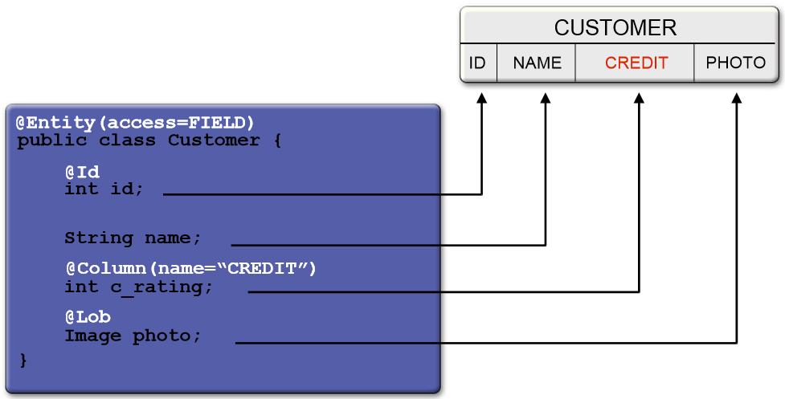
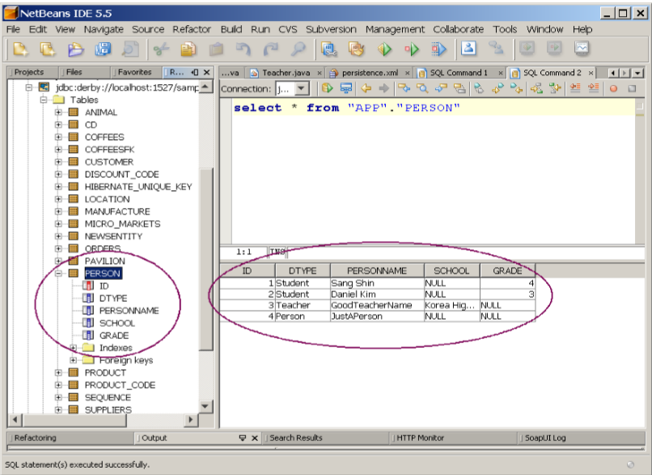

# Java Persistence API

---

## Agenda

- Java Persistence Requirements (Basic)
- What is an Entity (Basic)
- JPA Programming Model (Basic)
- Entity Manager and Entity Life-cycle (Basic)
- Persistence Context and Entity Manager
- Transaction

---

## Agenda (contd.)

- Detached Entities
- Entity Relationships
- O/R Mapping
- Embedded objects
- ompound primary key
- Entity Listeners
- Query

---

## Java Persistence Requirements

- Simplification of the persistence model
  - Elimination of deployment descriptor
- Light-weight persistence model
  - In terms of programming and deployment model as well as runtime performance
- Testability outside of the containers
  - Create test clients that would use entities in a non-managed environment
- Domain modelling through inheritance and polymorphism
- Object/Relational (O/R) mapping
- Extensive querying capabilities

---

## Common Java Persistence Between J2SE and J2EE Environments 

- Persistence API expanded to include use outside of EJB container 
- Evolved into “common” Java persistence API 
  - You can use new Java persistence API in Java SE, Web, and EJB applications
- Support for pluggable, third-party persistence providers 
- Through persistence.xml

---

## What is An Entity

- Plain Old Java Object (POJO)
  - Created by means of new keyword 
- No need to implement interfaces
- May have both persistent and non-persistent state
  - Simple types (e.g., primitives, wrappers, enums)
  - Composite dependent object types (e.g., Address) 
  - Non-persistent state (transient or @Transient)
- Can extend other entity and non-entity classes
- Serializable; usable as detached objects in other tiers
  - No need for data transfer objects

---

## Entity Example

```java
@Entity public class Customer implements Serializable { 
  @Id 
  protected Long id; 
  protected String name; 
  @Embedded 
  protected Address address; 
  protected PreferredStatus status; 
  @Transient 
  protected int orderCount; 
  public Customer() {} 
  public Long getId() {return id;} 
  protected void setId(Long id) {this.id = id;} 
  public String getName() {return name;} 
  public void setName(String name) {this.name = name;}
  … 
}
```

---

## Entity Identity

- Every entity has a persistence identity
  - Maps to primary key in database
- Can correspond to simple type
  - @Id—single field/property in entity class
  - @GeneratedValue—value can be generated automatically using various strategies (SEQUENCE, TABLE, IDENTITY, AUTO)
- Can correspond to user-defined class 
  - @EmbeddedId—single field/property in entity class
  - @IdClass—corresponds to multiple Id fields in entity class 
- Must be defined on root of entity hierarchy or mapped superclass

---

## Java Persistence Programming Model

- Entity is a POJO (no need to implement EntityBean)\
- Use of Annotation to denote a POJO as an entity (instead of deployment descriptor) 

```java
// @Entity is an annotation
// It annotates Employee POJO class to be Entity
@Entity
public class Employee {      
  // Persistent/transient fields
  // Property accessor methods
  // Persistence logic methods
}
```

---

## Persistence Entity Example

```java
@Entity
public class Customer {
  private Long id;
  private String name;
  private Address address;
  private Collection<Order> orders = new HashSet();
  public Customer() {}
  @Id
  public Long getID() {
    return id;
  }
  protected void setID (Long id) {
    this.id = id;   
  }
  ...
```

note: 
- class Customer annotated as Entity
- @Id denotes as primary key
- Getters/ setters to access state


---

## Persistent Entity Example (Contd.)

```java
  ...
  // Relationship between Customer and Orders 
  @OneToMany 
  public Collection<Order> getOrders() {
    return orders;
  }
  public void setOrders(Collection<Order> orders) {
    this.orders = orders;
  }
  // Other business methods
  ...
}
```

---

## Client View: From Stateless Session Bean

```java
@Stateless
public class OrderEntry {
  // Dependency injection of Entity Manager for
  // the given persistence unit
  @PersistenceContext 
  EntityManager em;
  public void enterOrder(int custID, Order newOrder){
    //Use find method to locate customer entity
    Customer c = em.find(Customer.class, custID);
    // Add a new order to the Orders
    c.getOrders().add(newOrder);  newOrder.setCustomer(c);  
  }
  // other business methods
}
```

---

## Entity Manager

- Similar in functionality to Hibernate Session, JDO PersistenceManager, etc.
- Controls life-cycle of entities
  - persist() - insert an entity into the DB
  - remove() - remove an entity from the DB
  - merge() - synchronize the state of detached entities
  - refresh() - reloads state from the database

---

## Persist Operation

```java
public Order createNewOrder(Customer customer) {
  // Create new object instance – transient state
  Order order = new Order(customer);
  //  Transitions new instances to managed. On the
  //  next flush or commit, the newly persisted
  //  instances will be inserted into the database table.
  entityManager.persist(order);
  return order;
} 
```

---
##  Client Code: From Java SE Client

```java 
public static void main(String[] args) {
  EntityManagerFactory emf =
    Persistence.createEntityManagerFactory("EmployeeService");
  EntityManager em = emf.createEntityManager();
  Collection emps = em.createQuery("SELECT e FROM Employee e")
    .getResultList();
  // More code
}
```

---

## Find and Remove Operations

```java
public void removeOrder(Long orderId) {
  Order order =
    entityManager.find(Order.class, orderId);
   // The instances will be deleted from the table
   // on the next flush or commit. Accessing a
   // removed entity has undefined results.
   entityManager.remove(order);
 } 
```

---

## Merge Operation

```java
public OrderLine updateOrderLine(OrderLine orderLine) {
  // The merge method returns a managed copy of
  // the given detached entity. Changes made to the
  // persistent state of the detached entity are
  // applied to this managed instance.
  return entityManager.merge(orderLine);
} 
```

---

## Demo #1

- Creating Entities from Existing Database tables
- Performing CRUD (Create, Read, Update, Delete) operations against    Entities 

---

## Persistence Context & Entity Manager

- Persistence context
  - Represents a __set of managed entity instances__ at runtime
  - “Entity instance is in managed state” means it is contained in a particular persistent context
  - Entity instances in a particular persistent context behaves in a consistent manner
- Entity manager
  - Performs life-cycle operations on entities – manages persistence context
 
---

## Persitence Context & Entity Manager (Contd.)

- Persistence context is __not__ directly accessible to developers
  - There is no programming API for accessing persistence context – there is no need
  - Persistence context is accessed indirectly through entity manager
- The type of entity manager determines how a persistence context is created and removed
- Why do you care as a developer?
  

---

## Persitence Context & Entity Manager (Contd.)

- Why do you care as a developer?
  - Because inclusion or exclusion of an entity into/from the persistence context will affect the outcome of any persistence operation on it

---

## Types of Entity Managers

- Container-Managed Entity Manager (Java EE environment)
  - Transaction scope entity manager
  - Extended scope entity manager
- Application-Managed Entity Manager (Java SE environment)

---

## How Entity Manager Is Created

- Different type of Entity Manager is created and acquired by an application differently
  - Container-managed entity manager (for Java EE) is acquired by an application through @PersistenceContext annotation – the container creates an entity manager and injects it into the application
  - Application-managed entity manager (for Java SE) is created and closed by the application itself

---

## Demo #2

Creating Entity Manager Creating Entity Manager for Java SE Environment

---

## Entity Managers & Persistence Context

- Different type of Entity Manager creates and manages a persistence context differently
  - The lifetime of persistence context is determined by the type of Entity manager

---

## Transaction-Scope Entity Manager

- Persistence context is created when a transaction gets started and is removed when the transaction is finished (committed or rolled-back) 
  - The life-cycle of the persistence context is tied up with transactional scope
- Persistence context is propagated
  - The same persistence context is used for operations that are being performed in a same transaction
- The most common entity manager in Java EE environment

---

## Extended-Scope Entity Manager

- Extended-scope Entity manager work with a single persistent context that is tied to the life-cycle of a stateful session bean

---

## Transaction Types

- Two different transaction types
  - Resource-local transactions
  - JTA (Java Transaction API)
    - Multiple participating resources
    - Distributed XA transactions
- Transaction type is defined in persistence unit (persistence.xml file)
  - Default to JTA in a Java EE environment
  - Default to RESOURCE_LOCAL in a Java SE environment

---

## @TransactionAttribute Annotation

- TransactionAttributeType.REQUIRED
- TransactionAttributeType.REQUIRES_NEW
- TransactionAttributeType.MANDATORY
- TransactionAttributeType.NOT_SUPPORTED
- TransactionAttributeType.NEVER
- TransactionAttributeType.SUPPORTS

---

## Entity Manager and Transaction Type 

- Container managed entity manager use JTA transactions
- Propagation of persistence context with a JTA transaction is supported by the container
  - Sharing same persistence context among multiple entity managers

---

## Transactions & Persistence Context

- Transactions define when new, modified, or removed entities are synchronized with the database
- How persistence context is created and used is determined by
  - Transaction type (JTA or Resource-local) and
  - Transaction attribute (REQUIRED or ..)

---

## Demo #3

 Use two different transaction attributes and see how persistence context is propagated.

---

## Demo Scenarios

- There are two stateless beans
  - EmployeeServiceBean (Calling bean)
  - AuditServiceBean (Callee bean)

---

## Demo Scenarios (Contd.)

- #1: The createEmployee() method of the EmployeeServiceBean invokes logTransaction() method of the AuditServiceBean
  - logTransaction() is set with TransactionAttributeType.REQUIRED annotation 
- #2: The createEmployee2() method of the EmployeeServiceBean invokes logTransaction2() method of the AuditServiceBean
  - logTransaction2() is set with TransactionAttributeType.REQUIRES_NEW annotation

---

## EmployeeServiceBean (Calling Bean)

```java
@Stateless
public class EmployeeServiceBean implements EmployeeService {
  @PersistenceContext(unitName="EmployeeService")
  private EntityManager em;
  @EJB
  AuditService audit;
  public void createEmployee(Employee emp) {
    em.persist(emp);
    audit.logTransaction(emp.getId(), "created employee");
  }
  public void createEmployee2(Employee emp) {
    em.persist(emp);
    audit.logTransaction2(emp.getId(), "created employee");
  }
}
```

---

## AuditServiceBean (Callee Bean)

```java
@Stateless
public class AuditServiceBean implements AuditService {
  @PersistenceContext(unitName="EmployeeService")
  private EntityManager em;
  @TransactionAttribute(TransactionAttributeType.REQUIRED)//Default
  public void logTransaction(int empId, String action) {
    // verify employee number is valid
    if (em.find(Employee.class, empId) == null) {
      throw new IllegalArgumentException("Unknown employee id");
    }
    LogRecord lr = new LogRecord(empId, action);
    em.persist(lr);
  }
  @TransactionAttribute(TransactionAttributeType.REQUIRES_NEW)
  public void logTransaction2(int empId, String action) {
    // ... same code as logTransaction() ...    
  }
}
```

---

## Behind the Scene: Scenario #1

- The createEmployee() method of the EmployeeServiceBean (Calling bean) invokes logTransaction() method of the AuditServiceBean (Callee bean) 
 - logTransaction() of AuditServiceBean (Bean #2) is set with TransactionAttributeType.REQUIRED annotation
- The createEmployee() method of Bean #1 starts a new transaction A as default, thus creating a persistence context A
  - The newly created Employee object A belongs to persistence context A

---

## Behind the Scene: Scenario #1 (Contd.)

- The transaction A and persistence context A of createEmploy() method of Calling bean is propagated to the logTransaction() method of Callee bean
  - The logTransaction() method has access to Employee object A

---

## Behind the Scene: Scenario #2

- The createEmployee2() method of the EmployeeServiceBean (Calling bean) invokes logTransaction2() method of the AuditServiceBean (Callee bean)
  - logTransaction2() of AuditServiceBean (Callee bean) is set with TransactionAttributeType.REQUIRES_NEW annotation 
- The createEmployee2() method of Calling bean starts a new transaction A as default, thus creating a persistence context A
  - The newly created Employee object A belongs to persistence context A

---

## Behind the Scene: Scenario #2

- The logTransaction2() method of Callee bean creates a new transaction B, thus a new persistence context B
  - The persistence context B does not have Employee object A
  - Employee object A still belongs to persistence context A
  - em.find() will fail

---

## Detached Entities

- Must implement Serializable interface if detached object has to be sent across the wire
- No need for DTO (Data Transfer Object) anti-design pattern
- Merge of detached objects can be cascaded  

---

## Transition to Detached Entities

- When a transaction is committed or rollback'ed
- When an entity is serialized

---

## O/R Mapping

- Comprehensive set of annotations defined for mapping
  - Relationships
  - Joins
  - Database tables and columns
  - Database sequence generators
  - Much more
- Specified using
  - Annotations within the code
  - Separate mapping file

---

## Simple Mappings



---

## O/R Mapping Example1

```java
@Entity
@Table(name="EMPLOYEE", schema="EMPLOYEE_SCHEMA")
uniqueConstraints={@UniqueConstraint(columnNames={"EMP_ID", "EMP_NAME"})}
public class EMPLOYEE {
  ...
  @Column(name="NAME", nullable=false, length=30)
  public String getName() { return name; } 
}
```

---

## Entity Relationships

- Models association between entities
- Supports unidirectional as well as bidirectional relationships
  - Unidirectional relationship: Entity A references B, but B doesn't reference A
- Cardinalities
  - One to one
  - One to many
  - Many to one
  - Many to many

---

## Many to Many Example

```java
@Entity
public class Project {
  private Collection<Employee> employees;

  @ManyToMany
  public Collection<Employee> getEmployees() {
    return employees;
  }
  public void setEmployees(Collection<Employee> employees) {
    this.employees = employees;
  }
... 
}
```

---

## Cascading Behavior

- Cascading is used to propagate the effect of an operation to associated entities
- Cascade=PERSIST
- Cascade=REMOVE
- Cascade=MERGE
- Cascade=REFRESH
- Cascade=ALL

---

## Entity Inheritance

- Entities can now have inheritance relationship
  - They are POJO's
- Three inheritance mapping strategies (mapping entity inheritance to database tables)
  - Single table
  - Joined subclass
  - Table per class
- Use annotation @Inheritance(..)

---

## Single Table Strategy 

- All the classes in a hierarchy are mapped to a single table
- Annotation to the parent Entity
  - @Inheritance(strategy=InheritanceType.SINGLE_TABLE)
- Root table has a discriminator column whose value identifies the specific subclass to which the instance represented by row belongs
  - @DiscriminatorColumn(columnDefinition="MYDTYPE")

---

## Single Table Strategy Example

```java
// Parent Entity
@Entity
@Inheritance(strategy=InheritanceType.SINGLE_TABLE)
@DiscriminatorColumn(columnDefinition="MYDTYPE")
public class Person implements Serializable {...}

// Child Entity
@Entity
public class Student extends Person {...}

// Child Entity
@Entity
public class Teacher extends Person {...} 
```

---

## Single Table Strategy Example



---

## Joined Strategy

- One table for each class in the hierarchy
  - A parent class is represented by a single common table
  - Each child class is represented by a separate table that contains fields specific to the child class as well as the columns that represent its primary key(s)
  - Foreign key relationship exists between parent common table and subclass tables
- Annotation to the parent Entity
  - @Inheritance(strategy=InheritanceType.JOINED)

---

## Joined Table Strategy Example

```java
// Parent Entity
@Entity @Inheritance(strategy=InheritanceType.JOINED)
@DiscriminatorColumn(columnDefinition="MYDTYPE")
public class Person implements Serializable {...} 

// Child Entity
@Entity
public class Student extends Person {...}

// Child Entity
@Entity
public class Teacher extends Person {...}
```

---

## Demo #4

- Use different strategies for Use different strategies for inheritance and how database are created
  - SINGLE_TABLE
  - JOINED

---

## Demo Scenario

- Person class is parent class
  - It has name field
- Student class is a child class of the Person class
  - It has school and grade fields
- We will use SINGLE_TABLE strategy first
  - Create 1 instance of Person class
  - Create 2 instances of Student class
  - Observe that a single table has 3 entries 

---

## Demo Scenario (Contd.)

- We will use JOIN_TABLE strategy second
  - Create 1 instance of Person class
  - Create 2 instances of Student class
  - Observe that there are two tables – Person and Student

---

## So Which One Should You Use?

- SINGLE_TABLE or JOIN_TABLE

---

## SINGLE_TABLE

- Advantages
  - Offers best performance even for in the deep hierarchy since single select may suffice
- Disadvantages
  - Changes to members of the hierarchy require column to be altered, added or removed from the table

---
 
## JOIN_TABLE

 - Advantages
  - Does not require complex changes to the schema when a single parent class is modified
  - Works well with shallow hierarchy
 - Disadvantages
  - Can result in poor performance – as hierarchy grows, the number of joins required to construct a leaf class also grows