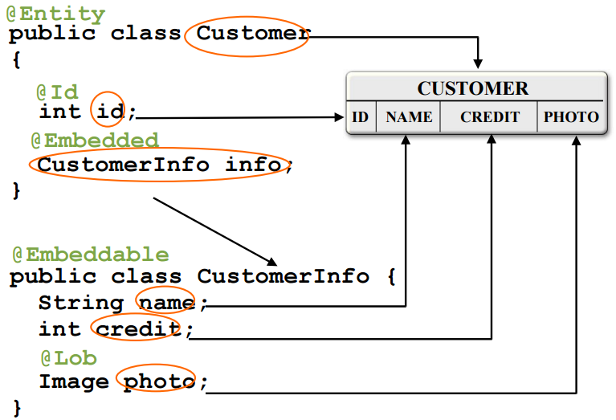

# Java Persistence API

---

## Agenda

- Java Persistence Requirements (Basic)
- What is an Entity (Basic)
- JPA Programming Model (Basic)
- Entity Manager and Entity Life-cycle (Basic)
- Persistence Context and Entity Manager
- Transaction

---

## Agenda (contd.)

- Detached Entities
- Entity Relationships
- O/R Mapping
- Embedded objects
- ompound primary key
- Entity Listeners
- Query

---

## Java Persistence Requirements

- Simplification of the persistence model
  - Elimination of deployment descriptor
- Light-weight persistence model
  - In terms of programming and deployment model as well as runtime performance
- Testability outside of the containers
  - Create test clients that would use entities in a non-managed environment
- Domain modelling through inheritance and polymorphism
- Object/Relational (O/R) mapping
- Extensive querying capabilities

---

## Common Java Persistence Between J2SE and J2EE Environments 

- Persistence API expanded to include use outside of EJB container 
- Evolved into “common” Java persistence API 
  - You can use new Java persistence API in Java SE, Web, and EJB applications
- Support for pluggable, third-party persistence providers 
- Through persistence.xml

---

## What is An Entity

- Plain Old Java Object (POJO)
  - Created by means of new keyword 
- No need to implement interfaces
- May have both persistent and non-persistent state
  - Simple types (e.g., primitives, wrappers, enums)
  - Composite dependent object types (e.g., Address) 
  - Non-persistent state (transient or @Transient)
- Can extend other entity and non-entity classes
- Serializable; usable as detached objects in other tiers
  - No need for data transfer objects

---

## Entity Example

```java
@Entity public class Customer implements Serializable { 
  @Id 
  protected Long id; 
  protected String name; 
  @Embedded 
  protected Address address; 
  protected PreferredStatus status; 
  @Transient 
  protected int orderCount; 
  public Customer() {} 
  public Long getId() {return id;} 
  protected void setId(Long id) {this.id = id;} 
  public String getName() {return name;} 
  public void setName(String name) {this.name = name;}
  … 
}
```

---

## Entity Identity

- Every entity has a persistence identity
  - Maps to primary key in database
- Can correspond to simple type
  - @Id—single field/property in entity class
  - @GeneratedValue—value can be generated automatically using various strategies (SEQUENCE, TABLE, IDENTITY, AUTO)
- Can correspond to user-defined class 
  - @EmbeddedId—single field/property in entity class
  - @IdClass—corresponds to multiple Id fields in entity class 
- Must be defined on root of entity hierarchy or mapped superclass

---

## Java Persistence Programming Model

- Entity is a POJO (no need to implement EntityBean)\
- Use of Annotation to denote a POJO as an entity (instead of deployment descriptor) 

```java
// @Entity is an annotation
// It annotates Employee POJO class to be Entity
@Entity
public class Employee {      
  // Persistent/transient fields
  // Property accessor methods
  // Persistence logic methods
}
```

---

## Persistence Entity Example

```java
@Entity
public class Customer {
  private Long id;
  private String name;
  private Address address;
  private Collection<Order> orders = new HashSet();
  public Customer() {}
  @Id
  public Long getID() {
    return id;
  }
  protected void setID (Long id) {
    this.id = id;   
  }
  ...
```

note: 
- class Customer annotated as Entity
- @Id denotes as primary key
- Getters/ setters to access state


---

## Persistent Entity Example (Contd.)

```java
  ...
  // Relationship between Customer and Orders 
  @OneToMany 
  public Collection<Order> getOrders() {
    return orders;
  }
  public void setOrders(Collection<Order> orders) {
    this.orders = orders;
  }
  // Other business methods
  ...
}
```

---

## Client View: From Stateless Session Bean

```java
@Stateless
public class OrderEntry {
  // Dependency injection of Entity Manager for
  // the given persistence unit
  @PersistenceContext 
  EntityManager em;
  public void enterOrder(int custID, Order newOrder){
    //Use find method to locate customer entity
    Customer c = em.find(Customer.class, custID);
    // Add a new order to the Orders
    c.getOrders().add(newOrder);  newOrder.setCustomer(c);  
  }
  // other business methods
}
```

---

## Entity Manager

- Similar in functionality to Hibernate Session, JDO PersistenceManager, etc.
- Controls life-cycle of entities
  - persist() - insert an entity into the DB
  - remove() - remove an entity from the DB
  - merge() - synchronize the state of detached entities
  - refresh() - reloads state from the database

---

## Persist Operation

```java
public Order createNewOrder(Customer customer) {
  // Create new object instance – transient state
  Order order = new Order(customer);
  //  Transitions new instances to managed. On the
  //  next flush or commit, the newly persisted
  //  instances will be inserted into the database table.
  entityManager.persist(order);
  return order;
} 
```

---
##  Client Code: From Java SE Client

```java 
public static void main(String[] args) {
  EntityManagerFactory emf =
    Persistence.createEntityManagerFactory("EmployeeService");
  EntityManager em = emf.createEntityManager();
  Collection emps = em.createQuery("SELECT e FROM Employee e")
    .getResultList();
  // More code
}
```

---

## Find and Remove Operations

```java
public void removeOrder(Long orderId) {
  Order order =
    entityManager.find(Order.class, orderId);
   // The instances will be deleted from the table
   // on the next flush or commit. Accessing a
   // removed entity has undefined results.
   entityManager.remove(order);
 } 
```

---

## Merge Operation

```java
public OrderLine updateOrderLine(OrderLine orderLine) {
  // The merge method returns a managed copy of
  // the given detached entity. Changes made to the
  // persistent state of the detached entity are
  // applied to this managed instance.
  return entityManager.merge(orderLine);
} 
```

---

## Demo #1

- Creating Entities from Existing Database tables
- Performing CRUD (Create, Read, Update, Delete) operations against    Entities 

---

## Persistence Context & Entity Manager

- Persistence context
  - Represents a __set of managed entity instances__ at runtime
  - “Entity instance is in managed state” means it is contained in a particular persistent context
  - Entity instances in a particular persistent context behaves in a consistent manner
- Entity manager
  - Performs life-cycle operations on entities – manages persistence context
 
---

## Persitence Context & Entity Manager (Contd.)

- Persistence context is __not__ directly accessible to developers
  - There is no programming API for accessing persistence context – there is no need
  - Persistence context is accessed indirectly through entity manager
- The type of entity manager determines how a persistence context is created and removed
- Why do you care as a developer?
  

---

## Persitence Context & Entity Manager (Contd.)

- Why do you care as a developer?
  - Because inclusion or exclusion of an entity into/from the persistence context will affect the outcome of any persistence operation on it

---

## Types of Entity Managers

- Container-Managed Entity Manager (Java EE environment)
  - Transaction scope entity manager
  - Extended scope entity manager
- Application-Managed Entity Manager (Java SE environment)

---

## How Entity Manager Is Created

- Different type of Entity Manager is created and acquired by an application differently
  - Container-managed entity manager (for Java EE) is acquired by an application through @PersistenceContext annotation – the container creates an entity manager and injects it into the application
  - Application-managed entity manager (for Java SE) is created and closed by the application itself

---

## Demo #2

Creating Entity Manager Creating Entity Manager for Java SE Environment

---

## Entity Managers & Persistence Context

- Different type of Entity Manager creates and manages a persistence context differently
  - The lifetime of persistence context is determined by the type of Entity manager

---

## Transaction-Scope Entity Manager

- Persistence context is created when a transaction gets started and is removed when the transaction is finished (committed or rolled-back) 
  - The life-cycle of the persistence context is tied up with transactional scope
- Persistence context is propagated
  - The same persistence context is used for operations that are being performed in a same transaction
- The most common entity manager in Java EE environment

---

## Extended-Scope Entity Manager

- Extended-scope Entity manager work with a single persistent context that is tied to the life-cycle of a stateful session bean

---

## Transaction Types

- Two different transaction types
  - Resource-local transactions
  - JTA (Java Transaction API)
    - Multiple participating resources
    - Distributed XA transactions
- Transaction type is defined in persistence unit (persistence.xml file)
  - Default to JTA in a Java EE environment
  - Default to RESOURCE_LOCAL in a Java SE environment

---

## @TransactionAttribute Annotation

- TransactionAttributeType.REQUIRED
- TransactionAttributeType.REQUIRES_NEW
- TransactionAttributeType.MANDATORY
- TransactionAttributeType.NOT_SUPPORTED
- TransactionAttributeType.NEVER
- TransactionAttributeType.SUPPORTS

---

## Entity Manager and Transaction Type 

- Container managed entity manager use JTA transactions
- Propagation of persistence context with a JTA transaction is supported by the container
  - Sharing same persistence context among multiple entity managers

---

## Transactions & Persistence Context

- Transactions define when new, modified, or removed entities are synchronized with the database
- How persistence context is created and used is determined by
  - Transaction type (JTA or Resource-local) and
  - Transaction attribute (REQUIRED or ..)

---

## Demo #3

 Use two different transaction attributes and see how persistence context is propagated.

---

## Demo #4

 Use different strategies for inheritance and how database tables are created:   
 - SINGLE_TABLE   
 - JOINED

---

## Demo Scenario

- Person class is parent class
  - It has _name_ field
- Student class is a child class of the Person class
  - It has _school_ and _grade_ fields
- We will use SINGLE_TABLE strategy first
  - Create 1 instance of Person class
  - Create 2 instances of Student class
  - Observe that a single table has 3 entries
- We will use JOIN_TABLE strategy second
  - Create 1 instance of Person class
  - Create 2 instances of Student class
  - Observe that there are two tables - Person and Student

---

## So Which One Should You Use?

- SINGLE_TABLE or JOIN_TABLE


---

## SINGLE_TABLE

- Advantages
  - Offers best performance even for in deep hierarchy since single select may suffice
- Disadvantages
  - Changes to members of the hierarchy require column to be altered, added or removed from table
  


---

##  JOIN_TABLE

- Advantages
  - Does not require complex changes to the schema when a single parent class is modified
  - Works well with shallow hierarchy
- Disadvantages
  - Can result in poor performance -- as hierarchy grows, the number of joins required to construct a leaf class also grows


---

##  Embedded Objects


---

##  Embedded Objects

- @Embeddable used to mark an embeddable object
- Embeddable object is stored as instrinsic part of an owning entity
  - Doesn't have its own identity
- Each persistent field/property of embeddable object is mapped to the same database table that represents the owning entity

---

##  Embedded Objects




---

##  Compound Primary Keys


---

##  Compound Primary Keys

- Entity has identifier that is composed of multiple fields
- The primary key of the tables is made of multiple columns
- Primary key class needs to be defined
  - Has to be _Serializable_ type
- Primary key class can be one of two types
  - Embeddable class annotated with @Embeddable
  - Id class annotated with @IdClass

---

##  @Embeddable and @EmbeddedId Example

```java
@Entity
public class Employee {
  // Employee is @Embeddable tyoe
  @EmbeddedId private EmployeeId id;
  
  private String name;
  private Long salary;
  
  // more code
}
```

---

##  Query


---

##  EJB-QL Enhancements

- Support for dynamic queries in addition to named queries or static queries
- Polymorphic queries
- Bulk update and delete operations
- Joins
- Group By / Having
- Subqueries
- Additional SQL functions
  - UPPER, LOWER, TRIM, CURRENT_DATE, ...

---

##  Queries

- Static queries
  - Defined with Java language metadata or XML
    - Annotations: @NamedQuery, @NamedNativeQuery
- Dynamic queries
  - Query string is specified at runtime
- Use Java Persistence query language or SQL
- Named or positional parameters
- Entity Manager is factory for Query objects
  - createNamedQuery, createQuery, createNativeQuery
- Query methods for controlling max results, pagination, flush mode

---

##  Dynamic Queries

```java
// Build and execute queries dynamically at runtime.

public List findWithName(String name) {
  return em.createQuery(
    "SELECT c FROM Customer c" + 
    "WHERE c.name LIKE :custName")
    .setParameter("custName", name)
    .setMaxResults(10)
    .getResultList();
}
```

---

##  Static Query

```java
@NamedQuery(name="customerFindByZipcode", 
  query=
  "SELECT c FROM Customer c WHERE
  c.address.zipcode = :zip")

@Entity public class Customer { ... }

...

public List findCustomerByZipCode(int zipcode) {
  return em.createNamedQuery("customerFindByZipCode")
        .setParameter("zip", zipcode)
        .setMaxResults(20)
        .getResultList();
}
  
```

---

##  Named Queries

```java
// Named queries are a useful way to create reusable queries

@NamedQuery(
  name="findCustomersByName",
  queryString="SELECT c FROM Customer c " +
              "WHERE c.name LIKE :custname"
)

@PersistenceContext public EntityManager em;

List customers = 
  em.createNamedQuery("findCustomersByName")
  .setParameter("custName, "Smith")
  .getResultList(); 

```

---

##  Polymorphic Queries

- All Queries are polymorphic by default
  - That is to say that the FROM clause of a query designates not only instances of the specific entity class to which it explicitly refers but of subclasses as well

```sql
select avg(e.salary) from Employee e where e.salary > 80000
```
    
This example returns average salaries of all employees, including subtype of Employee, such as manager.

---

##  Subqueries

```sql
SELECT DISTINCT emp 
FROM Employee emp
WHERE EXISTS (
  SELECT mgr 
  FROM Manager mgr 
  WHERE emp.manager = mgr
    AND emp.salary > mgr.salary
)
```

---

##  Joins

- Adds keyword JOIN in EJB-QL
- Supports
  - Inner Joins
  - Left Joins/Left outer joins
  - Fetch join
    - Enables pre-fetching of association data as a side-effect of the query
    
```sql
SELECT DISTINCT c FROM Customer c LEFT JOIN FETCH c.orders WHERE c.address.state = 'MA'
```

---

##  Projection

```sql
SELECT e.name, d.name
FROM Employee e JOIN e.department d
WHERE e.status = 'FULLTIME'
```

```sql
SELECT new com.example.EmployeeInfo(e.id, e.name, e.salary, e.status, d.name)
FROM Employee e JOIN e.department d
WHERE e.address.state = 'CA'
```

---

##  Update, Delete

```sql
UPDATE Employee e
SET e.salary = e.salary * 1.1
WHERE e.department.name = 'Engineering'
```


```sql
DELETE
FROM Customer c
WHERE c.status = ‘inactive’
  AND c.orders IS EMPTY
  AND c.balance = 0
```

---

##  Entity Listeners


---

##  Entity Listeners

- Listeners or callback methods are designated to receive invocations from persistence provider at various stages of entity lifecycle
- Callback methods
  - Annotate callback handling methods right in the entity class or put them in a separate listener class
  - Annotations
    - PrePersist/ PostPersist
    - PreRemove/ PostRemove
    - PreUpdate / PostUpdate
    - PostLoad
        
---

##  Entity Listeners: Example – 1

```java
@Entity
@EntityListener(com.acme.AlertMonitor.class)
public class AccountBean implements Account {
  Long accountId;
  Integer balance;
  boolean preferred;
  public Long getAccountId() { ... }
  public Integer getBalance() { ... }
  
  @Transient context
  public boolean isPreferred() { ... }
  
  public void deposit(Integer amount) { ... }
  public Integer withdraw(Integer amount) throws NSFException {... }
```

---

##  Entity Listeners: Example – 2

```java
  @PrePersist
  public void validateCreate() {
    if (getBalance() < MIN_REQUIRED_BALANCE)
      throw new AccountException("Insufficient balance to
      open an account");
  }
  
  @PostLoad
  public void adjustPreferredStatus() {
    preferred =(getBalance() >=
    AccountManager.getPreferredStatusLevel());
  }
}

```

---

##  Entity Listeners: Example – 3

```java
public class AlertMonitor {
  @PostPersist
  public void newAccountAlert(Account acct) {
    Alerts.sendMarketingInfo(acct.getAccountId(),
    acct.getBalance());
  }
}
```
