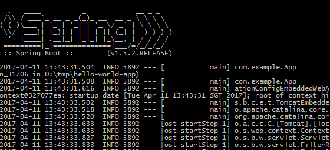

## Training Outcome

- Know what Spring Framework is
- Able to mention more than one Spring Modules
- Able to create Hello World Webapp in Spring
- Know what MVC pattern is
- Able to implement Web Controller in Spring
    + using Spring Boot
    + Spring Annotation not xml config
    + @Controller, @RequestMapping, @RequestParam, @RequestBody
    + Simple unit testing
- Spring Data Short Introduction: Entity & Repository

---

### Training Requirements

- Java SDK 1.8
- Apache Maven 3.x
- spring-boot-starter-web 1.5.2.RELEASE
- spring-boot-starter-test 1.5.2 RELEASE
- junit 4.12
- spring-boot-starter-tomcat 1.5.2.RELEASE
- tomcat-embed-jasper 8.5.6
- jstl 1.2

---

## Spring Framework Overview

What is Spring Framework?

---

### Spring Framework? on docs.spring.io

The Spring Framework is a **Java platform** that provides <em>**comprehensive infrastructure**</em> support for developing Java applications. Spring handles the infrastructure so you can <em>focus on your application</em>.

Spring enables you to build applications from "plain old Java objects" (POJOs) and to apply enterprise services non-invasively to POJOs. This capability applies to the Java SE programming model and to full and partial Java EE.

---

### Benefits of Using the Spring Framework

- Develop enterprise applications using POJOs.
- Modular application, which promote re-usable.
- Wiring existing technologies, e.g.: Hibernate ORM, Logging library, Apache Struts.
- Lightweight IoC containers.
- Testing module easier, let the framework inject dependencies.
- Support web MVC framework and REST.
- Provide scalable transaction management

---

### Spring Modules


---

### Spring Modules

- Core Container: BeanFactory and Application Context
    + Dependency Injection: aka Inversion of Control
- AOP and Instrumentation: Alliance-compliant appliesect-oriented programming implementation
- Messaging: integration with messaging service
- Data Access: Object-Relational mapping and Repository
- Web: web integration, servlet, REST web service 

---

## Development Environment Setup

- Maven pom.xml
- Spring Initializr
- Spring Tool Suite

---

### Spring Dependencies in Maven

pom.xml
```xml
<dependencies>
    <dependency>
        <groupId>org.springframework.boot</groupId>
        <artifactId>spring-boot-starter-web</artifactId>
        <version>...</version>
    </dependency>
    <dependency>
        <groupId>org.springframework.boot</groupId>
        <artifactId>spring-boot-starter-test</artifactId>
        <version>...</version>
        <scope>test</scope>
    </dependency>
</dependencies>
```

---

### Spring Plugin in Maven

```xml
<build>
    <plugins>
        <plugin>
            <groupId>org.springframework.boot</groupId>
            <artifactId>spring-boot-maven-plugin</artifactId>
        <plugin>
    </plugins>
</build>
```

---

### Compile and Running the Maven Project

- Compile: `maven compile`
- Run: `maven spring-boot:run`
    + call spring maven plugin and start Spring App / Spring Container

---

### Gradle Setup

```
buildscript {
    ...
    dependencies {
        classpath("org.springframework.boot:spring-boot-gradle-plugin")
    }
}

apply plugin: 'java'
apply plugin: 'org.springframework.boot'

...
dependencies {
    compile("org.springframework.boot:spring-boot-starter-web")
    testCompile("org.springframework.boot:spring-boot-starter-test")
}
```

---

### Spring Initializr and STS

- Spring Initializr:
    + please go to **http://start.spring.io**
    + fill in the **group**, **artifact** and **dependencies**
    + then click **generate project**
- alternative link: http://start.spring.io/sts
- Spring Tool Suite is downloadable program please visit
    + http://spring.io/tools/sts


---

## Hello World in Spring

```java
@SpringBootApplication
public class App {
    // ... beans

    public static void main(String[] args) {
        SpringApplication.run(App.class, args);
    }
}
```

Validate it with call spring maven plugin.



---

### Hello World in Spring (contd)

- `SpringApplication.run` will launch our application
- `@SpringBootApplication` is a convenience annotation that adds:
    + @Configuration tags the class as configuration class
    + @EnableAutoConfiguration tell Spring Boot to add beans automatically
    + @EnableWebMvc flags the application as a webapp
    + `@ComponentScan` look for other components, configurations and services

---

### Create Bean

Bean that retrieve all created beans

```java
public class App {
    // ...
    @Bean
    public CommandLineRunner printAll(ApplicationContext ctx) {
        return args -> {
            System.out.println("All beans provided by Spring Boot:")
            String[] beanNames = ctx.getBeanDefinitionNames();
            for (String beanName : beanNames)
                System.out.println(beanName);
        };
    }
}
```

Validate after call spring maven plugin, we should see app as bean name.

---

### Short Intro @Bean

TODO

---

### Java POJO as Component

```java
@Component
public class HelloWorld {

    private String message;

    public void setMessage(String message) {
        this.message = message;
    }

    public String getMessage() {
        return message;
    }

    public void printMessage() {
        System.out.println("Your message: " + message);
    }
}
```

---


### HelloWorld Injection

```java
public class App {
    // ...
    @Bean
    CommandLineRunner printMessage(HelloWorld component) {
        return args -> {
            component.setMessage("hello component");
            component.printMessage();
        }
    }
}
```

Validate it again, and make sure we see "hello component".

---

### Hello World Webapp in Spring

Create our first Controller.

```java
@Controller
public class HelloController() {

    @RequestMapping("/hello")
    @ResponseBody
    public String hello() {
        return "Greetings from Spring Boot!";
    }
}
```

Re-run our Spring Application, and open http://localhost:8080/hello

---

## Model-View-Controller Pattern


---

### Request Workflow on Spring MVC

 

---

### Request Workflow (contd)

- Front Controller/ Dispatcher Servlet receive HTTP request.
- Dispatcher consult handler mapping to call appropriate controller.
- Dispatcher call the controller, then controller return the model.
- Dispatch resolve appropriate view to render response.
- Finally dispatch render the view on the browser.

---

## Controller in Spring

- Put `@Controller` or `@RestController` on a class
    + Those annotations flag the following class is controller component, that automatically injected into the container.
    + `@RestController` annotates the class with `@Controller` and `@ResponseBody`.
- `@ResponseBody` wraps the method's return in HTTP response.

---

### Handler Mapping

- Put `@RequestMapping` to map controller/method with URI. 
- `@RequestMapping` has optional element:
    + `value` is URL relative path.
    + `method` the HTTP request method e.g.: GET, POST, etc.
- Other than `@RequestMapping`, Spring provides `@GetMapping`, `@PostMapping`.
- Consult http://docs.spring.io/spring/docs/current/javadoc-api for detail

---

### Request Parameters

- Method mapped to handle request has flexible signature.
    + `hello()`
    + `hello(String message)`
- To inject parameter from GET query string, use @RequestParam
    + URI path: `localhost/hello?message=Hello%20World`
    + Method signature: `hello(@RequestParam String message)`, given aforementioned URI path. message value is `"Hello World"`

---

### Request Parameters (contd)

- `@RequestParam` has optional element:
    + name: the request parameter to bind to
    + defaultvalue: when value missing, this value is injected.

```java
public String hello(
        @RequestParam(value = "message", defaultValue = "Hello Spring")
        String message
    ) {
        return "Your message: " + message;
}
```

---

### Request Body

- Other than `@RequestParam`, request body is injectable too with `@RequestBody`

```java
public String hello(@RequestBody String message) {

    return "Your message: " + message;
}
```

---

### URI Path Pattern

- Spring can inject from URI path variable also.

```java
@RequestMapping(value = "/{message}")
public String hello(@PathVariable String message) {
    // ...
    return "Your message: " + message;
}
```

- Regular expression on URI path is possible.
- Please consult Spring docs to know more, e.g.: `@RequestHeader`, `@RequestPart`

---

### Hands on coding

- Please create 3 controllers that:
    + mapping URI `'host/employees?gender=male'`
        + hint: @RequestMapping GET, @RequestParam
    + mapping URI `'host/employeees'`, with request method POST and request body
        + hint: @RequestMapping POST, @RequestBody
    + mapping URI `'host/employees/{id}'`, with request method PUT and request body
        + hint: @RequestMapping PUT, @PathVariable

---

## Unit Testing

- By default, maven put JUnit as dependency.

```xml
    <dependency>
      <groupId>junit</groupId>
      <artifactId>junit</artifactId>
      <version>3.8.1</version>
      <scope>test</scope>
    </dependency>
```

- In test-driven development, we write broken test first. Then we do the coding that pass the test.
- Run the test: `mvn test`.
- For this training, please use JUnit 4.12.

---

### Unit Testing (contd.)

- This example for JUnit testing.

```java
public class AppTest {

    @Test
    public void itShouldRun() {
        // ... test than run matcher
        assertTrue(true);
    }
}
```

---

## Exception Handler

TODO 

---

## JSP

TODO Form handling
TODO exception handling

---

## Short Intro to Persistence API

---

### Reference

- http://spring.io/guides/gs/spring-boot/
- http://www.tutorialspoint.com/spring/spring_hello_world_example.htm
- http://docs.spring.io/spring/docs/current/javadoc-api/
- http://docs.spring.io/spring/docs/current/spring-framework-reference/