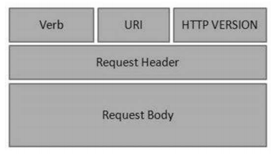
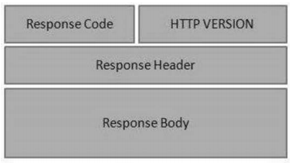

## Agenda

- REST
- RESTful Web Service
- RESTful Web Service with Spring REST

---

## REST

- REST stands for REpresentational State Transfer
- REST is a web standards based architecture and uses HTTP Protocol for data communication
- a REST Server simply provides access to resources and the REST client accesses and presents the resources
- REST uses various representations to represent a resource like Text, JSON and XML

---

## HTTP Methods

- GET - Provides a read only access to a resource
- PUT - Used to create a new resource
- DELETE - Used to remove a resource
- POST - Used to update an existing resource or create a new resource
- OPTIONS - Used to get the supported operations on a resource

---

## RESTful Web Service

- Web Service: a collection of open protocols and standards used for exchanging data between applications or systems
- RESTful Web Services: 
  - web services based on REST Architecture
  - use HTTP methods to implement the concept of REST architecture
  - defines a URI (Uniform Resource Identifier), which is a service that provides resource representation such as JSON and a set of HTTP Methods

---

## RESTful Web Service - Resources and Messages

- REST architecture treats every content as a resource
  - ex: Text Files, Html Pages, Images, Videos or Dynamic Business Data
- REST architecture transfer content via HTTP Protocols: HTTP Request and HTTP Response (messages)
- HTTP Request
  - Verb – Indicates the HTTP methods such as GET, POST, DELETE, PUT, etc
  - URI – Uniform Resource Identifier (URI) to identify the resource on the server
  - HTTP Version – Indicates the HTTP version. For example, HTTP v1.1.
  - Request Header – Contains metadata for the HTTP Request message as key-value pairs, ex: client (or browser) type, format supported by the client, format of the message body, cache settings, etc
  - Request Body – Message content or Resource representation

 

---

## RESTful Web Service - Resources and Messages (Contd.)

- HTTP Response
  - Status/Response Code – Indicates the Server status for the requested resource. ex: 404 means resource not found and 200 means response is ok
  - HTTP Version – Indicates the HTTP version. For example HTTP v1.1.
  - Response Header – Contains metadata for the HTTP Response message as key-value pairs. ex: content length, content type, response date, server type, etc
  - Response Body – Response message content or Resource representation

---

## RESTful Web Service - Security

- Validation – Validate all inputs on the server. Protect your server against SQL or NoSQL injection attacks
- Session Based Authentication – Use session based authentication to authenticate a user whenever a request is made to a Web Service method
- No Sensitive Data in the URL – Never use username, password or session token in a URL, these values should be passed to Web Service via the POST method
- Restriction on Method Execution – Allow restricted use of methods like GET, POST and DELETE methods. The GET method should not be able to delete data
- Validate Malformed XML/JSON – Check for well-formed input passed to a web service method
- Throw generic Error Messages – A web service method should use HTTP error messages like 403 to show access forbidden, etc

---

## HTTP Code

- __200__ OK - show success
- __201__ CREATED - when a resource is successfully created using POST or PUT request. Returns link to the newly created resource using the location header
- __204__ NO CONTENT - when response body is empty, ex: a DELETE request
- __304__ NOT MODIFIED – used to reduce network bandwidth usage in case of conditional GET requests. Response body should be empty. Headers should have date, location, etc
- __400__ BAD REQUEST – states that an invalid input is provided. ex: validation error, missing data
- __401__ UNAUTHORIZED – states that user is using invalid or wrong authentication token
- __403__ FORBIDDEN – states that the user is not having access to the method being used. For example, Delete access without admin rights
- __404__ NOT FOUND – states that the method is not available
- __409__ CONFLICT – states conflict situation while executing the method. For example,
adding duplicate entry
- __500__ INTERNAL SERVER ERROR – states that the server has thrown some exception while executing the method

---

## RESTful Web Service with Spring REST

- Spring REST overview
- Revisit Repository
- REST Controller
- Service

